# Enterprise Agentic Delivery Platform

**Governed AI-Driven Software Delivery for the Enterprise**

---

## Vision

### Autonomous Execution. Human Authority. Enterprise Trust.

The **Enterprise Agentic Delivery Platform** enables organizations to accelerate software delivery using AI agents **without sacrificing governance, security, or accountability**.

The platform introduces a **governed, agentic Software Development Life Cycle (SDLC)** where AI agents autonomously execute well-defined development tasks, while **humans retain authority over approvals, risk decisions, and releases**.

This is not “fully autonomous AI development.”
It is **controlled automation**, designed for enterprises operating under regulatory, security, and compliance constraints.

---

## Overview

The Enterprise Agentic Delivery Platform is a **portable, role-based Agentic SDLC** distributed as a **Git submodule** that can be installed into any existing repository.

It acts as an **automation and orchestration layer** over existing enterprise tools—Jira, Confluence, Git, CI/CD—enforcing governance rules while enabling AI-driven execution.

### Core Design Principles

* **Autonomy with Boundaries** – Agents execute tasks only within approved states
* **Human-in-the-Loop Governance** – All critical transitions require explicit human approval
* **Security by Default** – Continuous scanning, policy enforcement, and auditability
* **Enterprise Compatibility** – Works with existing tooling and workflows
* **Portability** – Repository-agnostic, versioned, and upgradeable

---

## End-to-End Delivery Flow (Canonical)

```mermaid
flowchart LR
    A[Jira Issue Created] --> B[Product Owner Agent]
    B --> C[Planning Agent]
    C --> D[Confluence Spec]
    D -->|Human Approval| E[Architecture Agent]
    E --> F[Developer Agent]
    F --> G[Code Review Agent]
    G --> H[Security Agent]
    H --> I[QA Agent]
    I --> J[Project Manager Agent]
    J -->|Release Approval| K[Production]
```



**No agent may bypass state transitions or approval gates.**

---

## Core Capabilities

## 1. Specialized AI Agents

The platform includes **nine bounded, role-specific agents**, each aligned to a real enterprise responsibility.

### Product Owner Agent

* Refines Jira backlog items
* Ensures business clarity and user value
* Validates INVEST-compliant user stories
* Identifies UX, accessibility, and usability concerns
* Flags ambiguous or conflicting requirements
* **Interactive Protocol**: Pauses for human approval before applying changes
* **Context Awareness**: Consults Agency Memory for corporate UX standards

---

### Planning Agent

* Translates approved requirements into:

  * Confluence specifications
  * Structured JSON implementation plans
* Performs technical reconnaissance of the repository (`ls -R`)
* Identifies dependencies, risks, and assumptions
* Defines explicit acceptance criteria
* **Intelligent Reconnaissance**: Understands codebase structure before planning
* **Interactive Protocol**: Waits for human approval before generating specs
* **Atomic Operations**: Creates complete Confluence specs with proper metadata

---

### Architecture Agent

* Designs system components and boundaries
* Produces Mermaid.js architecture diagrams
* Documents architectural trade-offs (ADRs)
* Evaluates scalability, performance, and security implications
* Aligns with enterprise architecture standards
* **Context Integration**: Enhances existing Confluence specs with technical designs
* **Interactive Protocol**: Pauses for approval before updating Confluence pages

---

### Developer Agent

* Implements features **only after dual-key approval**
* Adheres to repository coding standards
* Executes unit and integration tests
* Produces deterministic, reviewable commits
* Cannot introduce new scope or architectural changes
* **Interactive Protocol**: Lists files to be modified and waits for approval
* **Safety Checks**: Performs dual-key verification (Jira + Confluence) before any code changes
* **Fail-Safe Mechanism**: If linting fails twice, reverts files to original state
* **Commit Protocol**: Prefixes all commits with Jira ticket ID for traceability
* **Context Awareness**: Follows repository-specific branching and coding conventions

---

### Code Reviewer Agent

* Reviews changes against:

  * Acceptance criteria
  * Clean Code standards
  * Performance best practices
* Identifies maintainability and readability issues
* Ensures documentation completeness
* **Interactive Protocol**: Presents review results and waits for approval before posting feedback
* **Quality Gate**: Compares implementation against the original approved plan
* **State Management**: Handles both PASS and FAIL scenarios with appropriate state transitions

---

### Security Engineer Agent

* Performs static security analysis (SAST)
* Scans for secrets, credentials, and misconfigurations
* Identifies OWASP Top 10 risks
* Produces security audit reports
* Cannot approve its own findings
* **Comprehensive Scanning**: Analyzes both code changes and specification documents
* **Interactive Protocol**: Waits for approval before posting security findings
* **Fail-Safe Mechanism**: Explicitly cannot approve its own security findings

---

### DevOps Engineer Agent

* Validates CI/CD readiness
* Reviews infrastructure-as-code (IaC)
* Verifies deployment strategies and rollback plans
* Ensures monitoring and alerting are configured
* Does not deploy without release authorization
* **Tool Detection**: Automatically detects CI/CD configurations (GitHub Actions, Jenkins, etc.)
* **Context Awareness**: Adapts to repository's existing DevOps tools and configurations
* **Interactive Protocol**: Waits for approval before posting readiness reports

---

### QA Engineer Agent

* Generates automated test scenarios
* Executes regression and end-to-end tests
* Validates non-functional requirements
* Reports test coverage and quality metrics
* **Tool Detection**: Identifies testing frameworks (Playwright, Jest, Cypress, etc.) from package.json
* **Interactive Protocol**: Outlines planned tests and waits for approval before execution
* **Fail-Safe Mechanism**: Failed tests return tickets to approved state for re-implementation
* **Adaptive Testing**: Selects appropriate testing framework based on project configuration

---

### Project Manager Agent

* Synchronizes Jira and Confluence state
* Tracks delivery progress
* Manages releases and documentation
* Generates stakeholder-facing status reports
* Enforces governance workflows
* **Dual Mode Operation**: Operates in Governance Sync or Release mode based on needs
* **Interactive Protocol**: Offers mode selection and waits for human direction
* **Release Gate**: Verifies all required labels before allowing release
* **State Synchronization**: Maintains consistency between Jira and Confluence

---

## 2. Governance & Control Framework

### Dual-Key Safety Gate (Mandatory)

AI execution is permitted **only when both conditions are met**:

* **Jira**: Issue labeled `ai-state:approved`
* **Confluence**: Specification marked `Spec Status: APPROVED`

This ensures:

* Business approval
* Traceability
* Auditability
* Prevention of unauthorized changes

---

### State-Based Workflow

```text
ready-for-plan
→ plan-review
→ approved
→ in-development
→ in-qa
→ verified
→ security-pass / security-fail
→ reviewed / review-fail
```

State transitions are **explicit, logged, and immutable**.

---

### Human Oversight Points

Human approval is required for:

* Specification approval
* Architecture exceptions
* Security risk acceptance
* Production releases
* Governance overrides

AI agents **cannot self-approve or escalate privileges**.

---

## 3. Security & Compliance

### Security Capabilities

* Continuous secret scanning
* Dependency vulnerability analysis
* Static code security checks
* Configuration validation
* Policy enforcement

---

### Compliance Support (Assistive, Not Certifying)

The platform **supports** compliance efforts by providing:

* Complete audit trails
* Approval histories
* Change traceability
* Documentation automation

> The platform does not itself certify regulatory compliance
> (e.g., GDPR, HIPAA, SOX), but enables enforceable controls and evidence.

---

## 4. Context & Memory System

### Context Layers

* Global enterprise rules
* Repository-specific configurations
* Workflow state history
* Approved architectural decisions

### Learning Constraints

* Learning is **auditable**
* Learning does **not bypass governance**
* Learning can be frozen or reset
* No autonomous behavior modification

---

## 5. Intelligent Design Features

### Interactive Dashboard Protocol
* Each agent follows a strict protocol: "Find → Present → Wait for approval → Execute"
* Ensures human oversight at every major decision point
* Agents don't act autonomously; they pause for human confirmation

### Adaptive Intelligence
* **Tool Detection**: Agents automatically detect project-specific tools and frameworks
* **Context Awareness**: Agents adapt to repository-specific conventions and configurations
* **Reconnaissance**: Agents understand the existing codebase before making changes

### Fail-Safe Mechanisms
* **Revert Policies**: If quality checks fail, files are reverted to original state
* **Failure Recovery**: Failed validations return tickets to appropriate states for re-processing
* **Self-Limiting**: Agents cannot approve their own findings or escalate privileges

### Atomic Operations
* Each agent performs specific, limited functions
* Clear state transitions prevent conflicts and ensure consistency
* Each agent is responsible for specific labels and status updates

### Communication & Signaling
* Clear completion signals with ticket keys for transparency
* Detailed comments posted to Jira for audit trails
* Distinct operational modes (e.g., Governance Sync vs. Release)

---

## 6. Integration Capabilities

### Mandatory

* Git (version control)
* Jira (work tracking)
* Confluence (specification & approvals)
* OpenCode (agent orchestration)

### Optional

* CI/CD platforms (GitHub Actions, GitLab CI, Jenkins)
* Security tools (Snyk, SonarQube, Black Duck)
* Monitoring (Datadog, Prometheus)
* Communication (Slack, Teams)

---

## Technical Architecture

### Submodule-Based Distribution

* Installed as `.agency`
* Version-controlled upgrades
* Isolated configuration
* Backward compatibility guarantees

### Configuration

* Central `opencode.jsonc`
* Per-agent model assignment
* Environment-aware settings
* Validated before execution

---

## Explicit Non-Goals

The platform does **not**:

* Replace human accountability
* Auto-deploy without approval
* Modify governance rules autonomously
* Train foundation models on customer code
* Bypass security or compliance requirements

---

## Implementation Strategy

### Quick Start

```bash
git submodule add <REPO_URL> .agency
git submodule update --init --recursive
./.agency/setup.sh
opencode --config .agency/opencode.jsonc
```

### Adoption Phases

1. Non-critical projects
2. Team-level rollout
3. Enterprise-wide adoption with governance oversight

---

## Summary

The **Enterprise Agentic Delivery Platform** enables organizations to adopt AI-driven development **safely, incrementally, and audibly**.

It is not about replacing teams.
It is about **removing friction**, **enforcing standards**, and **making software delivery predictable at scale**.

### Key Innovations

* **Collaborative Intelligence**: Agents work as human collaborators, not replacements
* **Governed Autonomy**: Automation within strict, auditable boundaries
* **Adaptive Integration**: Works with existing tools and conventions
* **Fail-Safe Design**: Built-in recovery mechanisms for all operations
* **Transparent Operations**: Complete auditability of all agent actions
